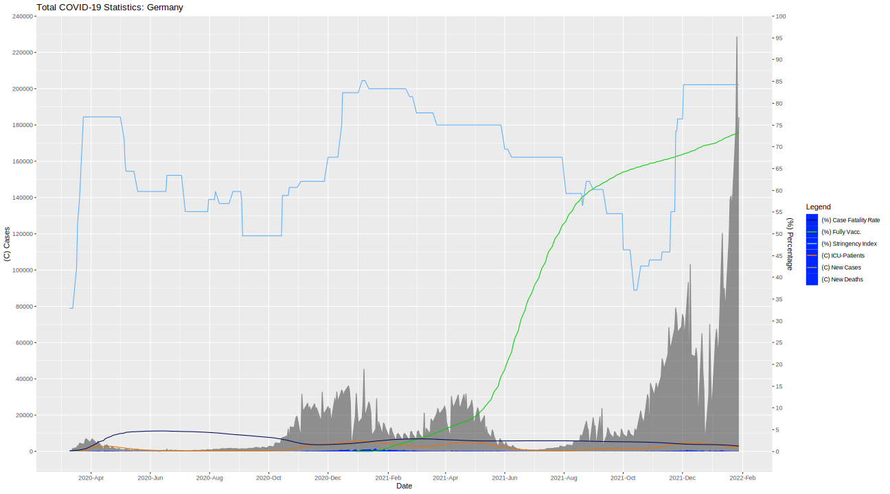

# This is a private project.

This is purely for fun and interest. Take everything you find with this scripts with a hefty grain of salt.

# Customising the Script

The script is made easy to customise so that you can get your own plot faster:

- To edit the plotted location, simply edit the `plot_loc` variable to your country's name in line 11.

- To change the plotted COVID-variant, edit the `plot_variant` variable in line 12.

- To keep the plot cleaner, cases and deaths below 0 are filtered out.
To change that setting, edit the `plot_cd_thres` in line 13.

- The scaling of the percentage axis is determined by `plot_perc_scaling` in line 14.

- `plot_prim_y_breaks` in line 15 determines the breaks in the left y-axis.

- `plot_sec_y_breaks` in line 16 contains the breaks for the right y-axis.

- The colors for the plot are defined in line 17 as `plot_colors`.

# Files

## Updating the COVID-19-Data
Use the `data-update.sh` to get the latest data for the R-scripts. The source is "Our World In Data".
The data file is `owid-covid-data.csv`.
## Other Files
Every other file should be self explaining - as there aren't many left.

#
Have fun with my little project!

# Latest Plot (Inconsistently updated)
WARNING: Around the turn of the year 2021-2022, the data is not at all accurate in Germany due to holidays for health workers.
\
INFO: Some data is smoothed out and therefore less accurate when viewing the data day by day. Smoothed data makes sense here so that general developments can be recognised easier.
