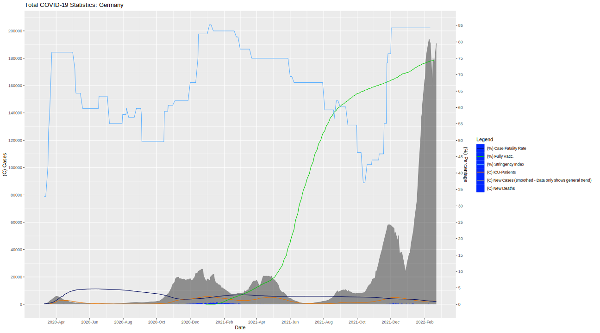

# This is a private project.

This is purely for fun and interest. Take everything you find with this scripts with a hefty grain of salt.

# Files

## Updating the COVID-19-Data
Use the `data-update.sh` to get the latest data for the R-scripts. The source is "Our World In Data".
The data files are `covid-variants.csv` and `owid-covid-data.csv`.
## Other Files
Every other file should be self explaining - as there aren't many left.

#
Have fun with my little project!

# Latest Plot (Inconsistently updated)

